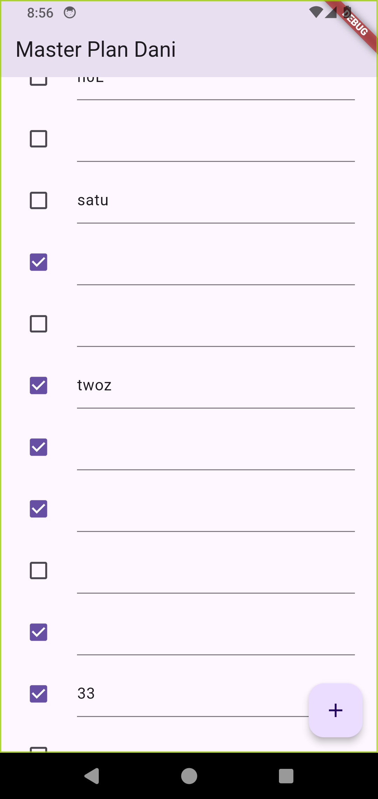
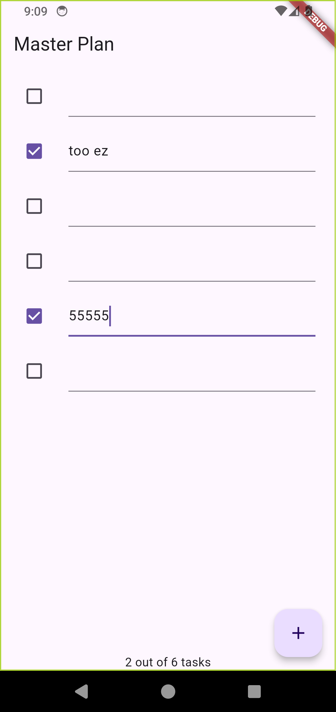
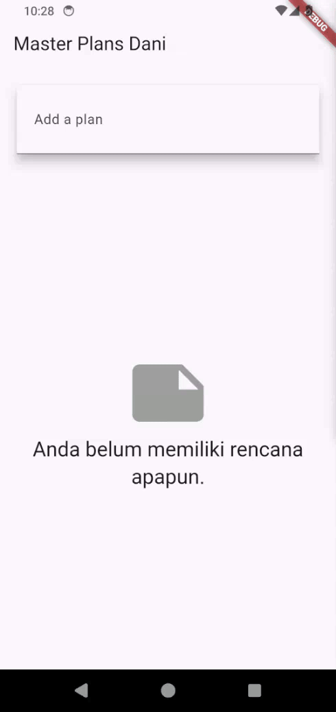
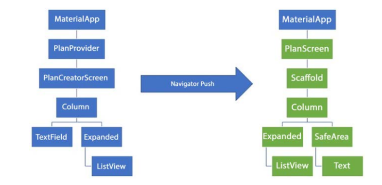

# 11 - Dasar State Management

| Nama | NIM |
|:----:|:---:|
| Dani Daneswara | 362358302048 |

## Praktikum 1

<h3 align="center">Hasil Akhir</h3>

  

### Jelaskan maksud dari langkah 4 pada praktikum tersebut! Mengapa dilakukan demikian?
Maksud dari langkah 4 pada praktikum berfungsi untuk mempermudah ketika melakukan impor model sehingga tidak perlu mengimpor satu per satu setiap file.

### Mengapa perlu variabel plan di langkah 6 pada praktikum tersebut? Mengapa dibuat konstanta ?
Variabel plan di langkah 6 pada praktikum diperlukan karena variabel plan diperlukan untuk menyimpan dan mengelola data task yang terkait dengan screen tersebut. Variabel ini menyimpan informasi tentang rask tertentu, seperti nama task.

### Lakukan capture hasil dari Langkah 9 berupa GIF, kemudian jelaskan apa yang telah Anda buat!
Hasil dari langkah 9. Disini telah dibuat button untuk menambahkan task yang muncul pada menu utama, pada task juga terdapat checkbox dan textbox yang bisa kita ubah.

### Apa kegunaan method pada Langkah 11 dan 13 dalam lifecyle state ?
- Method initState() dipanggil sekali ketika objek state dari widget dibuat, yaitu sebelum widget ditampilkan di layar. Ini adalah tempat yang tepat untuk menginisialisasi hal-hal yang membutuhkan konfigurasi atau setup awal saat widget pertama kali dibangun.
- Method dispose() dipanggil ketika widget akan dihancurkan dan tidak lagi diperlukan. Ini adalah tempat yang tepat untuk membersihkan resource atau melakukan pembersihan (cleanup) agar tidak terjadi kebocoran memori atau penggunaan resource yang tidak perlu.

## Praktikum 2

<h3 align="center">Hasil Akhir</h3>

  

### Jelaskan mana yang dimaksud InheritedWidget pada langkah 1 tersebut! Mengapa yang digunakan InheritedNotifier?
InheritedWidget digunakan untuk berbagi data di dalam pohon widget (widget tree) tanpa perlu melewatkan data melalui konstruktor setiap widget. Widget di bawahnya dapat mengakses data tersebut secara langsung. Sementara InheritedNotifier adalah subclass dari InheritedWidget yang mempermudah pemberitahuan perubahan data.

### Jelaskan maksud dari method di langkah 3 pada praktikum tersebut! Mengapa dilakukan demikian?
Fungsinya:
- `completedCount`: Menghitung jumlah tugas yang sudah selesai (complete == true) dalam Plan.
- `completenessMessage`: Menyediakan pesan yang menunjukkan progres tugas, seperti "3 out of 5 tasks".

Tujuannya:
- Memudahkan perhitungan progres tugas.
- Menghindari pengulangan kode dengan menyatukan logika dalam method.
- Memberikan informasi progres yang jelas pada UI.

### Lakukan capture hasil dari Langkah 9 berupa GIF, kemudian jelaskan apa yang telah Anda buat!
Hasil dari langkah 9 disini kita menambahkan sebuah widget yang fungsinya untuk menampilkan total task ada dan task yang sudah di checklist.

## Praktikum 3

<h3 align="center">Hasil Akhir</h3>

  

### Berdasarkan Praktikum 3 yang telah Anda lakukan, jelaskan maksud dari gambar diagram berikut ini!

  

Gambar diagram tersebut menunjukkan perubahan struktur widget di aplikasi Flutter ketika berpindah dari satu layar ke layar lain menggunakan Navigator.push. Diagram ini menggambarkan bagaimana Flutter mengatur dan mengelola hirarki widget pada dua layar yang berbeda, serta bagaimana Navigator.push memungkinkan perpindahan dari satu layar ke layar lain. Pada PlanScreen, struktur widget dioptimalkan untuk tampilan daftar tugas dengan informasi tambahan, sehingga membantu pengguna memahami progres dari tugas yang sedang dibuat.

### Lakukan capture hasil dari Langkah 14 berupa GIF, kemudian jelaskan apa yang telah Anda buat!
Hasil dari langkah 14 disini kita menambahkan sebuah widget yang fungsinya untuk menampilkan total task ada dan task yang sudah di checklist.
